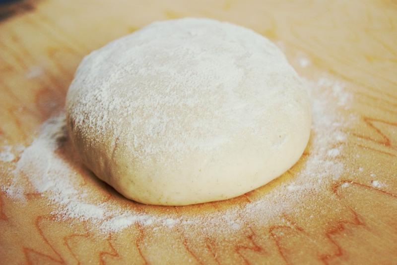

== Ciasto na pizzę (todo)
=== SKŁADNIKI
* 500g mąki 450 w ostateczności 500
* 30g soli
* 30g drożdży świeżych lub 10g drożdży suszonych (2,5 łyżeczki)
* pół łyżki soli (opcjonalnie)
* pół łyżki cukru (opcjonalnie)
* woda ciepła
* łyżeczka oliwy z oliwek lub oleju (opcjonalnie)
* semolina (opcjonalnie)

=== Wykonanie
Drożdże rozpuszczam w letniej wodzie. Dodaję mąkę cały czas mieszając. Dodać mąki na ręce i ugniatać do momentu aż nie przyklei się do rąk.
Wygniecione ciasto zostawić pod ścierką. Zostawić na wyrośnięcie około 2h.
Wyrośnięte ciasto można pokroić na 3-4 części i znowu odstawić do wyrośnięcia.
Aby nie zrobiła się skorupa na cieście można polać placek wodą.
Aby ciasto było chrupiące można posypywać je semoliną.

[#CiastoDoPizzy]
.Ciasto na pizzę
