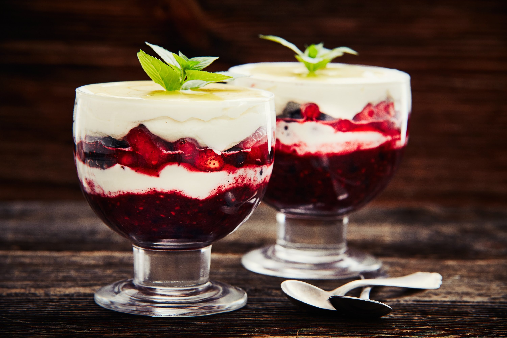

== Deser z owoców leśnych (TODO)
=== SKŁADNIKI
* Poziomki
* Jagody
* Jerzyny
* Czerwona porzeczka
* Maliny
* Drobny cukier
* Kminek rzymski
* Nasiona kardamonu
* Śmietana schłodzona
* Miód płynny
* Mięta pieprzowa

=== Wykonanie
Połowę poziomek, jagód, jerzyn, porzeczki wymieszać.
Kminek rzymski i nasiona kardamonu zmieżdżyć w moździerzu.
Zmiarzdżyć także resztę poziomek, jagód, jerzyn i czerwonej porzeczki. Powstanie nam wtedy "sos".
Śmietanę ubić z cukrem lub bez.
W mrożone pucharki dodać na dół "sos" a otem na zmianę zmieszane owoce/warzywa z ubitą śmietaną.
Wierzch można troszkę polać miodem. Ewentualnie udekorować miętą pieprzową.
[#DeserZOwocowLesnych1]
.Deser z owoców leśnych
