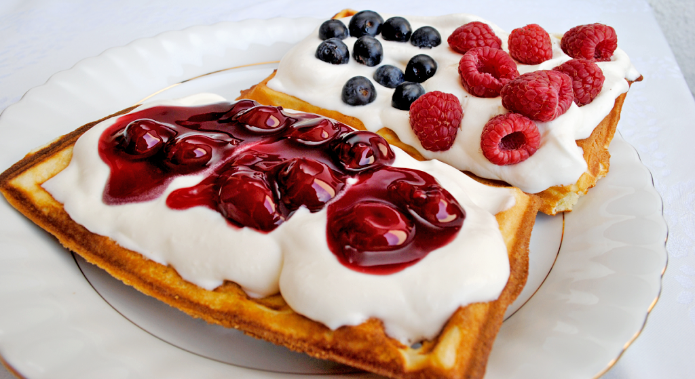

== Gofry
=== SKŁADNIKI
* cukier waniliowy 30g
* 2 jaja
* sól
* 2 szklanki mąki
* 2 szklanki mleka (obiętościowo ma być tyle mleka co mąki)
* 4 łyżki oleju
* płaska łyzka proszku do pieczenia
* dodatki: marmolada / bitaśmietana / nutella / itp..

=== Wykonanie
Rozdzielamy żółtka od białka. Białka trzepiemy z szczyptą soli aż się zrobi sztywna.
Do żółtka dodajemy cukier waniliowy i proszek do pieczenia. Miksujemy. Dodajemy do tego mąkę, mleko i olej. Miksujemy.
Na koniec dodajemy wcześniej ubite białko. I mieszamy ale nie miksujemy.
Gofrownicę nacieramy olejem i pieczemy masę przez 3-5 minut.

[#Gofry]
.Gofry
