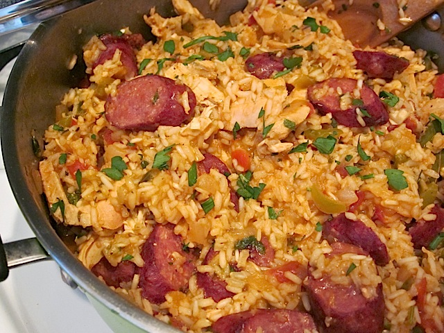

== Jambalaya
=== SKŁADNIKI
* torebka białego ryżu
* spażony pomidor
* kawałek kiełbaski
* pierś z kurczaka
* papryka
* cebula
* łyżka kurkumy
* łyżka słodkiej papryki
* łyżka kminku rzymskiego
* bulion
* pietruszka
* sól

=== Wykonanie
Kroimy kurczaka, kiełbasę, cebulę, obranego pomidora, paprykę. Smażymy cebulę z papryką.
Dodajemy do smażenia mięsa kurczaka i kiełbasę. Po jakimś czasie dorzucamy garść ryżu. Następnie
doprawiamy kurkumą, słodką papryczką, kminkiem rzymskim. Na koniec dorzucamy pomidora i dolewamy
bulion. Wszystko dusimy przez jakieś 20 minut. Przed wyjęciem posypać solą, pieprzem i pietruszką.

[#jambalaya1]
.Jambalaya
