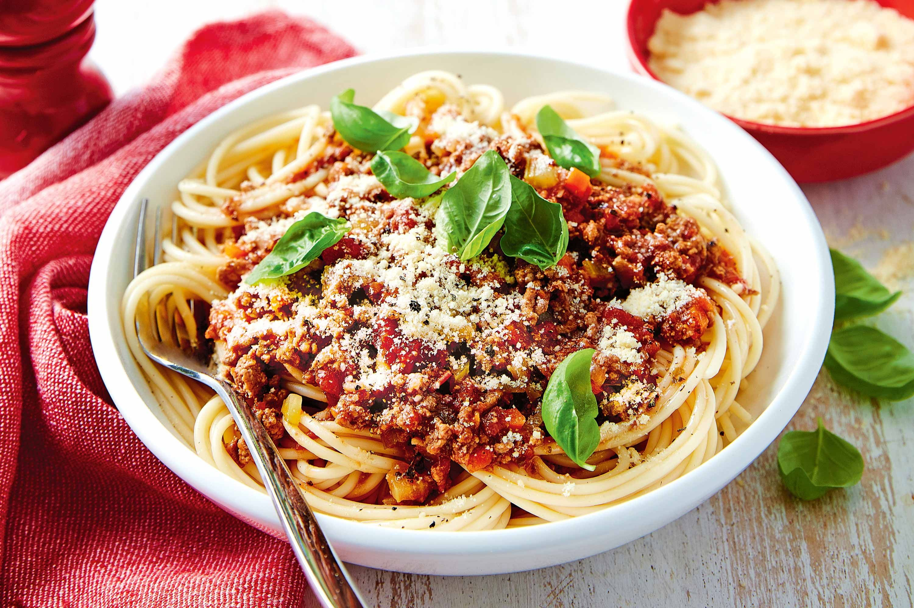

== Spaghetti Bolognese
=== SKŁADNIKI
* 500 g makaronu spaghetti
* 50 dkg mięsa mielone (wieprzowe/wołowe)
* kawałek sera
* Sól
* Pieprz
* Bazylia
* Oregano

=== Wykonanie
Makaron gotujemy w solonej wodzie. Międzyczasie smażymy mięso. Na koniec dodajemy przyprawy.
[#SpaghettiBolognese1]
.Spaghetti Bolognese
//link:spaghettiBolognese1.jpg[link]
image::./spaghettiBolognese1.jpg[Spaghetti bolognese,300,200,float="left"]
[#SpaghettiBolognese2]
.Spaghetti Bolognese

