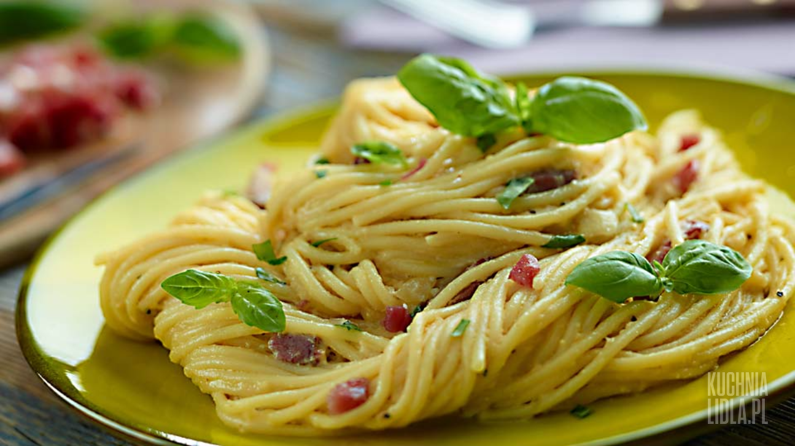

== Spaghetti Carbonarra
=== SKŁADNIKI
* 500 g makaronu spaghetti
* 200 g wędzonego boczku
* 250 ml śmietanki 30%
* 3 żółtka
* 1 ząbek czosnku
* 1 cebula
* 100 ml białego, wytrawnego wina
* 2 łyżki tartego sera grana padano
* Sól
* Pieprz
* Bazylia

=== Wykonanie
Makaron gotujemy w osolonej wodzie. Cedzimy.

Boczek kroimy w drobną kostkę, wrzucamy na rozgrzaną patelnię i podsmażamy, stale mieszając, aż się zrumieni. Cebulę siekamy. Zdejmujemy boczek z patelni i podsmażamy cebulę na tłuszczu, który się z niego wytopił. Do cebuli dodajemy wino. Czosnek drobno siekamy i przekładamy na patelnię. Całość dusimy około 5 minut.

W miseczce mieszamy żółtka, 120 ml śmietany oraz ser. Pozostałą śmietanę wlewamy na patelnię i dodajemy do niej przesmażony wcześniej boczek. Zmniejszamy płomień i dodajemy jajka ze śmietaną i serem. Przyprawiamy solą i pieprzem do smaku. Czekamy aż sos zgęstnieje. Zdejmujemy patelnię z ognia.

Do sosu przekładamy ugotowany makaron i dokładnie mieszamy. Bazylię drobno siekamy i dekorujemy nią spaghetti.

=== Fotografia z internetu
[#SpaghettiCarbonarra1]
.Spaghetti Carbonarra
